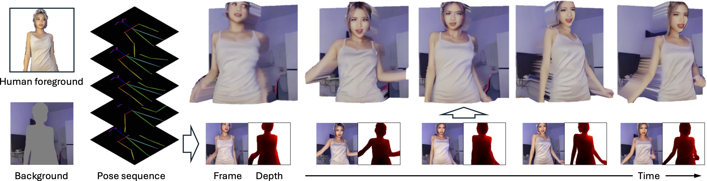

# [💃 IDOL: Unified Dual-Modal Latent Diffusion for Human-Centric Joint Video-Depth Generation](https://yhzhai.github.io/idol/)

 

[Yuanhao Zhai](https://www.yhzhai.com/)1, [Kevin Lin](https://sites.google.com/site/kevinlin311tw/)2, [Linjie Li](https://scholar.google.com/citations?hl=en&user=WR875gYAAAAJ)2, [Chung-Ching Lin](https://scholar.google.com/citations?hl=en&user=legkbM0AAAAJ)2, [Jianfeng Wang](http://jianfengwang.me)2, [Zhengyuan Yang](https://zyang-ur.github.io)2, [David Doermann](https://cse.buffalo.edu/~doermann/)1, [Junsong Yuan](https://cse.buffalo.edu/~jsyuan/)1, [Zicheng Liu](https://scholar.google.com/citations?hl=en&user=bkALdvsAAAAJ)3, [Lijuan Wang](https://scholar.google.com/citations?hl=en&user=cDcWXuIAAAAJ)2

1State University of New Yort at Buffalo  &nbsp; | &nbsp;  2Microsoft &nbsp;| &nbsp;  3Advanced Micro Devices

**European Conference on Computer Vision (ECCV) 2024**

&nbsp;

**TL;DR**: Our IDOL enables human-centric joint video-depth generation, which could be rendered into realistic 2.5 videos.

**All code and checkpoints will be released soon!**